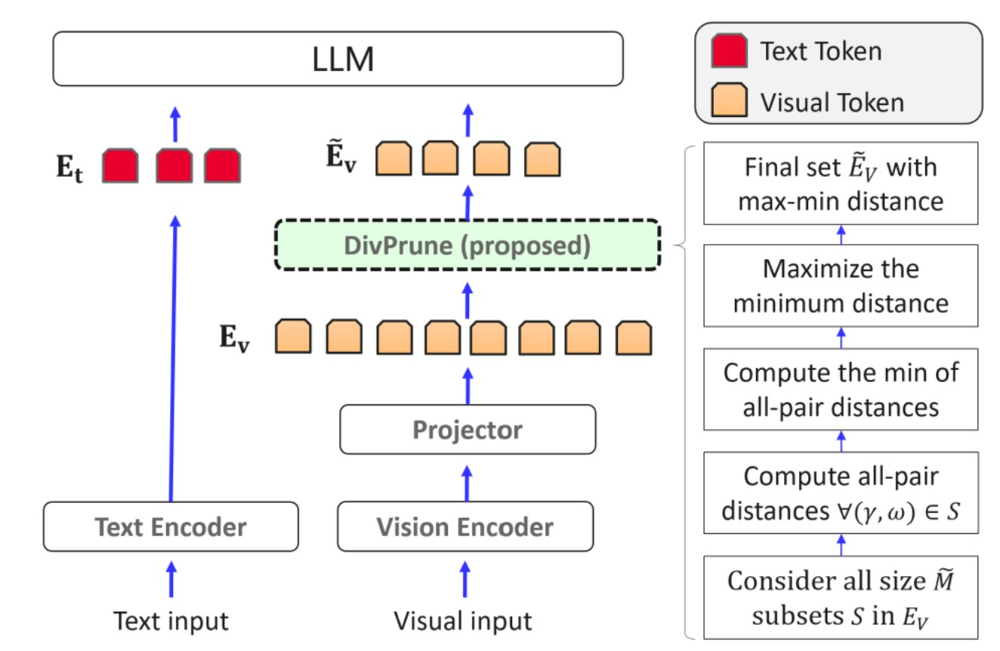

# DivPrune 
The repo for DivPrune: Diversity-based Visual Token Pruning for Large Multimodal Models. [[Arxiv]](https://arxiv.org/abs/2503.02175) 

DivPrune is accepted to CVPR 2025 🎉.   


<div align="center">
  
</div>


## Setup Enviroment
```sh
conda create -n divprune python=3.10 -y
conda activate divprune
conda install pytorch==2.1.2 torchvision==0.16.2 torchaudio==2.1.2 pytorch-cuda=11.8 -c pytorch -c nvidia
pip install -r requirements.txt
cd LLaVA
pip install -e .
cd ..
```

## DivPrune 
### Main Results
You can use the following script to re-produce the results in the paper. 

The default pretrained model is set to LLaVA 1.5 7b. Feel free to change the pre-trained model to get the results with other models.

The default retained ratio is set to 0.098. Adjust SUBSET_RATIO to get the results for other pruning ratios. 

```sh 
bash ./run_Divprune
```
### TFLOPs
Use the following to get the TFLOP numbers reported in the paper. 
 ```sh 
python ./tflops.py
```

### Efficiency 
The following script calculated the  memory and latency for DivPrune using LLaVA-1.6 model.
 ```sh 
bash ./eval_time.sh
```

## References: 
The code is implemented based on [lmms-eval](https://github.com/EvolvingLMMs-Lab/lmms-eval), [LLaVA](https://github.com/haotian-liu/LLaVA) and [FASTV](https://github.com/pkunlp-icler/FastV). 
We thanks the contributors for their great work!

## Citation 
If this code is useful, please cite it in your documents.
```@misc{alvar2025divprunediversitybasedvisualtoken,
      title={DivPrune: Diversity-based Visual Token Pruning for Large Multimodal Models}, 
      author={Saeed Ranjbar Alvar and Gursimran Singh and Mohammad Akbari and Yong Zhang},
      year={2025},
      eprint={2503.02175},
      archivePrefix={arXiv},
      primaryClass={cs.CV},
      url={https://arxiv.org/abs/2503.02175}, 
}
```
